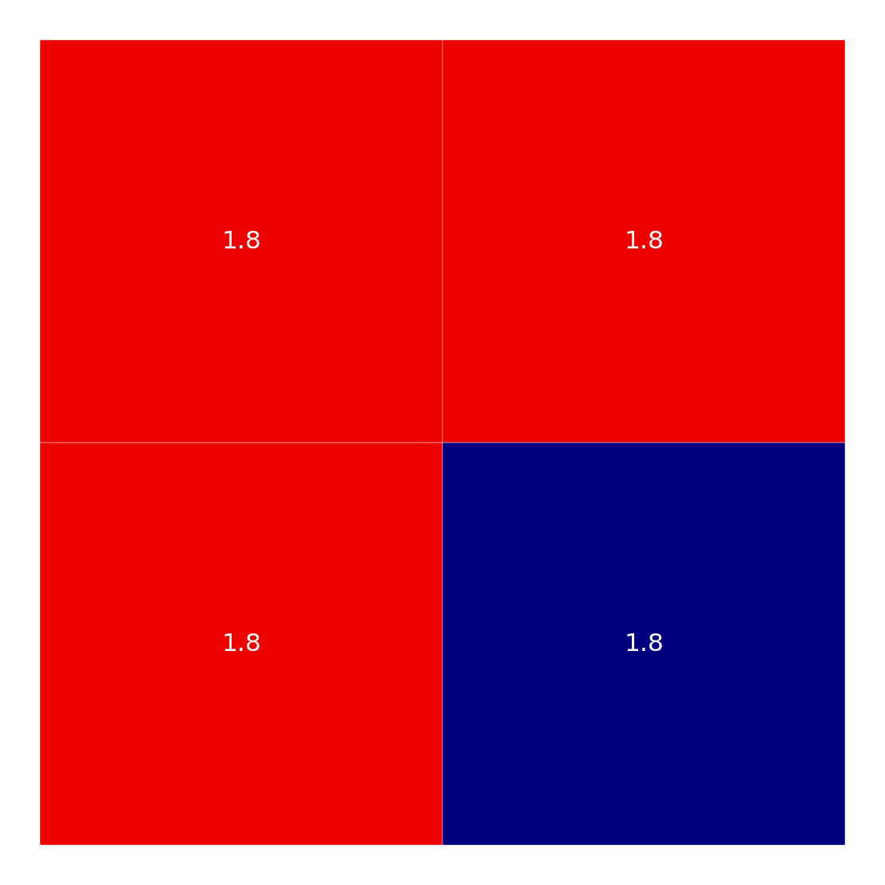

# Continuous Area Cartograms


<p  align="center">
    
    
    
    
    
    
    
    
    
    
    
    
    
    
    
    
    
    
    
    
    
    
    
    
    
</p>


This repository implements Dougenik, Chrisman, and Niemeyer's algorithm, which they described in the 1985 paper, *[An Algorithm to Construct Continuous Area Cartograms](references/paper.pdf)*.

We refer to the algorithm as the *DCN1985 Algorithm*, after its authors.

## Background

### What is a Cartogram?

A cartogram is a map in which some thematic mapping variable, such as population or Gross Domestic Product (GDP), is substituted for land area or distance. The geometry or space of the map is distorted in order to convey the information of this alternate variable. Cartograms help to visualize the relative sizes of the variables in a way that a traditional map does not, making them useful tools in geographical statistics.

### What is a Continuous Area Cartogram (CAC)?

A Continuous Area Cartogram (CAC) is a type of cartogram where the map is distorted gradually and smoothly to reflect a specific variable while maintaining the contiguous nature of regions. Unlike other cartograms that might use non-contiguous shapes or overlapping regions, CACs ensure that all areas are mapped to contiguous regions, preserving neighboring relationships. This makes them more recognizable and easier to understand in terms of geographical layout.

### Why are Cartograms Useful?

Cartograms are especially useful for providing a visual representation of statistical data, allowing for easy comparisons and understanding of geographic distributions of data. They highlight disparities and patterns that might be overlooked in standard map representations. For example, a cartogram can make it visually apparent how much larger the population of one city is compared to another, despite the actual geographic size being smaller.

## Install

```bash
pip install continuous_area_cartograms-nuuuwan
```

## Examples

In this example, we take a simple map consisting of four squares of equal area, and modify it such that one square ends up 4 times has large as the others.

<p align="center">
  
</p>

First, construct a **DCN1985 object**, providing the regions (as shapely Polygons) and their corresponding values.

Second, call **run** which returns a new polygon, appropriately modified.

```python
    import os

    from shapely import Polygon

    from cac import DCN1985

    polygons = [
        Polygon(
            [
                (0, 0),
                (0, 1),
                (1, 1),
                (1, 0),
                (0, 0),
            ]
        ),
        Polygon(
            [
                (1, 0),
                (1, 1),
                (2, 1),
                (2, 0),
                (1, 0),
            ]
        ),
        Polygon(
            [
                (0, 1),
                (0, 2),
                (1, 2),
                (1, 1),
                (0, 1),
            ]
        ),
        Polygon(
            [
                (1, 1),
                (1, 2),
                (2, 2),
                (2, 1),
                (1, 1),
            ]
        ),
    ]

    dcn = DCN1985(
        polygons,
        [1, 4, 1, 1],
    )

    new_polygon = dcn.run(
        dir_output=os.path.join(
            os.path.dirname(__file__),
            
        )
    )

    print(new_polygon)

```

Output:

```bash
[<POLYGON ((0.032 0.232, 0.142 0.979, 0.68 1.32, 0.587 0.078, 0.032 0.232))>, <POLYGON ((0.587 0.078, 0.68 1.32, 1.922 1.413, 2.122 -0.122, 0.587 0.078))>, <POLYGON ((0.142 0.979, 0.112 1.888, 1.021 1.858, 0.68 1.32, 0.142 0.979))>, <POLYGON ((0.68 1.32, 1.021 1.858, 1.768 1.968, 1.922 1.413, 0.68 1.32))>]
```

<p align="center">
  
</p>

Alternatively, DCN1985s objects can be constructed from [geopandas.GeoDataFrame](https://geopandas.org/en/stable/docs/reference/api/geopandas.GeoDataFrame.html) objects, [TopoJSON](https://openlayers.org/en/latest/examples/topojson.html), [GeoJSON](https://geojson.org/) or [gig.Ent](https://github.com/nuuuwan/gig) objects.

```python
    @classmethod
    def from_gdf(cls, gdf: gpd.GeoDataFrame, values: list[float], **kwargs):
        ...

    @classmethod
    def from_geojson(cls, geojson_path: str, values: list[float], **kwargs):
        ...

    @classmethod
    def from_topojson(cls, topojson_path: str, values: list[float], **kwargs):
        ...

    @classmethod
    def from_ents(cls, ents: list[Ent], values: list[float], **kwargs):
        ...
```

For more details and source code, see [examples](examples).

## The [Algorithm](references/paper.pdf)

```pseudocode
For each polygon
    Read and store PolygonValue (negative value illegal)
    Sum PolygonValue into TotalValue
 
For each iteration (user controls when done)
    For each polygon
        Calculate area and centroid (using current boundaries)
    Sum areas into TotalArea
    
    For each polygon
        Desired = (TotalArea * (PolygonValue / TotalValue))
        Radius = √ (Area / 𝜋)
        Mass = √ (Desired / 𝜋) - √ (Area / 𝜋)
        SizeError = Max(Area, Desired) / Min(Area, Desired)
    ForceReductionFactor = 1 / (1 + Mean (SizeError))

    For each boundary line; Read coordinate chain
        For each coordinate pair
            For each polygon centroid
                Find angle, Distance from centroid to coordinate
                    If (Distance > Radius of polygon)
                        Fij = Mas * (Radius / Distance)
                    Else
                        Fij = Mass * (Distance² / Radius²) * (4 - 3 * (Distance / Radius))
            Using Fij and angles, calculate vector sum
            Multiply by ForceReductionFactor
            Move coordinate accordingly
        Write distorted line to output and plot result
```

The intuition behind DCN1985, is as follows:

Our map is a collection of polygons, each representing a region. Some polygons need to be expanded, while others need to be contracted.

Every polygon influences how every point in every polygon is moved to achieve the expansion/contraction. Hence, the algorithm is *O(nm)*, where *n = number of polygons* and *m = number of points in each polygon*.
