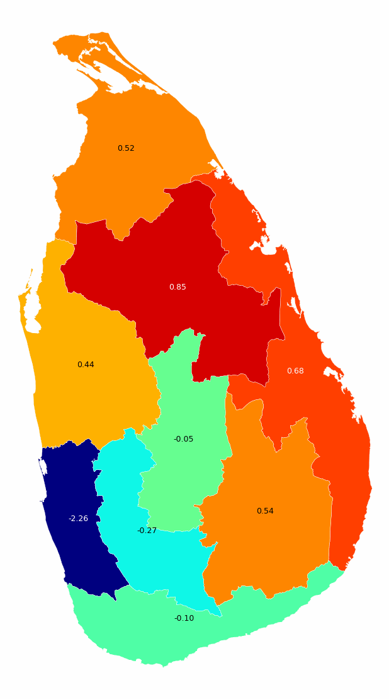
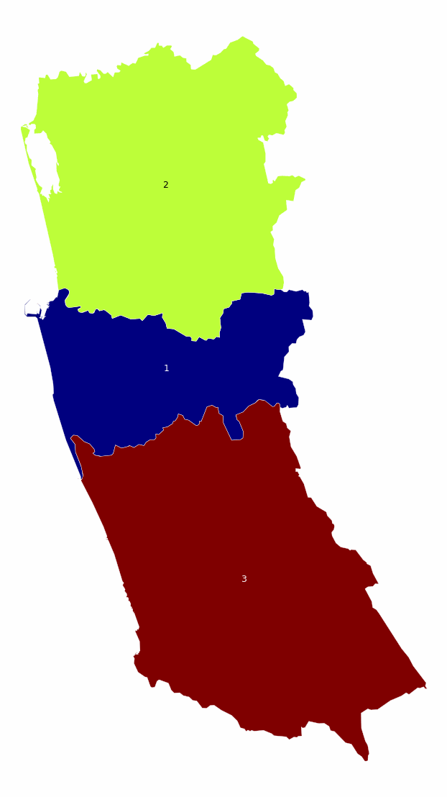

# Continuous Area Cartograms

Implements *[An Algorithm to Construct Continuous Area Cartograms](paper.pdf)* by Dougenik, Chrisman, and Niemeyer (1985).

## Examples

### [example_1_from_topojson.py](examples/example_1_from_topojson.py)



### [example_2_from_ents.py](examples/example_2_from_ents.py)



### [example_3_from_ents_by_population.py](examples/example_3_from_ents_by_population.py)


### [example_4_pds.py](examples/example_4_pds.py)


See more [Examples](README.examples.long.md).

## Usage

I plan to deploy this as a PyPI package, but for now you can clone the repository, install the dependencies, and run the code directly. You might also find the following [examples](examples) useful.

### TODOs before deployment

* Speed-up DAC algorithm, which is still too slow for maps with >20 polygons.
* Simplify and improve the API, which is still a little disorganized
* Add options to save polygons, as topojson etc
* Improve [examples](src/cac/examples)
* Generate some more complex examples, and possibly run them on a bigger processor on the cloud

## Algorithm described in [paper](paper.pdf)

```pseudocode
For each polygon
    Read and store PolygonValue (negative value illegal)
    Sum PolygonValue into TotalValue
 
For each iteration (user controls when done)
    For each polygon
        Calculate area and centroid (using current boundaries)
    Sum areas into TotalArea
    
    For each polygon
        Desired = (TotalArea * (PolygonValue / TotalValue))
        Radius = √ (Area / 𝜋)
        Mass = √ (Desired / 𝜋) - √ (Area / 𝜋)
        SizeError = Max(Area, Desired) / Min(Area, Desired)
    ForceReductionFactor = 1 / (1 + Mean (SizeError))

    For each boundary line; Read coordinate chain
        For each coordinate pair
            For each polygon centroid
                Find angle, Distance from centroid to coordinate
                    If (Distance > Radius of polygon)
                        Fij = Mas * (Radius / Distance)
                    Else
                        Fij = Mass * (Distance² / Radius²) * (4 - 3 * (Distance / Radius))
            Using Fij and angles, calculate vector sum
            Multiply by ForceReductionFactor
            Move coordinate accordingly
        Write distorted line to output and plot result
```

In code, we will refer to this as the *DNC Algorithm*, after its authors.

### Intuition

The intuition behind DNC, is as follows:

Our map is a collection of polygons, each representing a region. Some polygons need to be expanded, while others need to be contracted.

Every polygon influences how every point in every polygon is moved to achieve the expansion/contraction. Hence, the algorithm is *O(nm)*, where *n = number of polygons* and *m = number of points in each polygon*.
